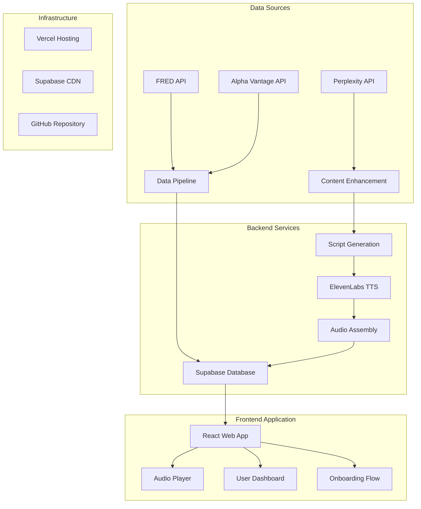

# Aperio.fin Technical Architecture

## Overview

Aperio.fin is a personalized financial audio magazine that transforms raw economic and market data into engaging, NPR Marketplace-style podcasts. The system automatically generates daily content using AI-powered script generation and multi-voice audio synthesis.

## System Architecture



## Core Components

### 1. Data Pipeline (Node.js Backend)

#### FRED API Integration
- **Purpose**: Economic indicator data for storytelling
- **Key Endpoints**:
  - `UNRATE` - Unemployment Rate
  - `CPIAUCSL` - Consumer Price Index
  - `FEDFUNDS` - Federal Funds Rate
  - `MORTGAGE30US` - 30-Year Mortgage Rate
  - `PAYEMS` - Nonfarm Payrolls
- **Update Frequency**: Daily batch processing at 6 AM ET
- **Rate Limits**: Unlimited (public data)
- **Cost**: Free

#### Alpha Vantage API Integration
- **Purpose**: Real-time market data and sentiment
- **Key Endpoints**:
  - `GLOBAL_QUOTE` - Daily stock prices
  - `SECTOR` - Sector performance
  - `TOP_GAINERS_LOSERS` - Market movers
  - `NEWS_SENTIMENT` - Market sentiment analysis
  - `EARNINGS_CALENDAR` - Upcoming earnings
- **Update Frequency**: Multiple times daily
- **Rate Limits**: 500 calls/day (Standard), 1200/min (Premium)
- **Cost**: $49.99/month (Standard), $149.99/month (Premium)

#### Perplexity API Integration
- **Purpose**: Context enrichment and narrative enhancement
- **Usage**:
  - Connect economic data to current events
  - Provide real-world examples and implications
  - Generate engaging story angles
- **Rate Limits**: 600 requests/day (Pro)
- **Cost**: $20/month (Pro)

### 2. Content Generation System

#### Script Generation Pipeline
```javascript
// Daily Content Generation Workflow
const generateDailyContent = async () => {
  // 1. Fetch latest economic data
  const economicData = await fetchFredData();
  const marketData = await fetchAlphaVantageData();

  // 2. Enrich with context
  const contextData = await enrichWithPerplexity(economicData, marketData);

  // 3. Generate scripts for different audiences
  const scripts = await generateScripts({
    learnMode: generateBeginnerScript(contextData),
    techBrief: generateTechScript(contextData),
    personalBrief: generatePersonalizedScript(contextData, userPreferences)
  });

  // 4. Convert to multi-voice audio
  const audioFiles = await generateAudio(scripts);

  // 5. Store in database
  await storeEpisodes(scripts, audioFiles);
};
```

#### Multi-Voice Audio System
- **Voice Profiles**:
  - **Sarah (Host)**: Warm, curious, audience-connecting
  - **Marcus (Analyst)**: Data-driven, precise, explanatory
  - **Elena (Economist)**: Expert, contextual, policy-focused
- **Audio Assembly**: Seamless dialogue with natural pauses and cross-talk
- **Quality**: Professional podcast-grade output

### 3. Database Schema (Supabase)

#### Core Tables
```sql
-- User Management
users (
  id UUID PRIMARY KEY,
  email VARCHAR UNIQUE,
  subscription_tier VARCHAR DEFAULT 'free',
  experience_level VARCHAR DEFAULT 'beginner',
  interests TEXT[],
  watchlist_symbols TEXT[]
);

-- Economic Data Cache
economic_indicators (
  series_id VARCHAR,
  date DATE,
  value DECIMAL(15,6),
  series_title VARCHAR,
  UNIQUE(series_id, date)
);

-- Market Data Cache
market_data (
  symbol VARCHAR,
  data_type VARCHAR,
  date DATE,
  raw_data JSONB,
  processed_data JSONB,
  UNIQUE(symbol, data_type, date)
);

-- Generated Content
content_episodes (
  id UUID PRIMARY KEY,
  episode_date DATE,
  content_type VARCHAR,
  script_content TEXT,
  audio_url VARCHAR,
  voice_profiles JSONB,
  generation_cost DECIMAL(10,4)
);

-- User Engagement
user_episodes (
  user_id UUID REFERENCES users(id),
  episode_id UUID REFERENCES content_episodes(id),
  completion_percentage DECIMAL(3,2),
  liked BOOLEAN DEFAULT false,
  bookmarked BOOLEAN DEFAULT false
);
```

### 4. Frontend Application (React)

#### Key Features
- **Progressive Web App (PWA)** with offline support
- **Persistent Audio Player** that follows user across pages
- **Interactive Onboarding** with financial literacy assessment
- **Personalized Dashboard** with listening history and preferences
- **Mobile-First Design** with responsive layout

#### Component Architecture
```
src/
├── components/
│   ├── AudioPlayer/          # Persistent audio player
│   ├── Onboarding/          # Multi-step user setup
│   ├── Dashboard/           # User home page
│   ├── EpisodeList/         # Content browser
│   └── Settings/            # User preferences
├── hooks/
│   ├── useAudio.js          # Audio player state
│   ├── useAuth.js           # Authentication
│   └── useEpisodes.js       # Content fetching
├── services/
│   ├── supabase.js          # Database client
│   ├── audio.js             # Audio management
│   └── analytics.js         # User tracking
└── utils/
    ├── constants.js         # App configuration
    └── helpers.js           # Utility functions
```

## API Endpoints & Integration Details

### FRED API Optimization
```javascript
const fredEndpoints = {
  inflation: {
    primary: "CPIAUCSL",        // Consumer Price Index
    supporting: ["CPILFESL", "PCEPI", "GASREGW"],
    storytelling: "inflation_impact_narrative"
  },
  employment: {
    primary: "UNRATE",          // Unemployment Rate
    supporting: ["PAYEMS", "ICSA", "AHETPI"],
    storytelling: "job_market_health_narrative"
  },
  housing: {
    primary: "MORTGAGE30US",     // 30-Year Mortgage Rate
    supporting: ["HOUST", "CSUSHPISA", "PERMIT"],
    storytelling: "housing_affordability_narrative"
  }
};
```

### Prompting Strategy

#### Perplexity Context Enrichment
```javascript
const contextPrompt = (economicData) => `
Analyze current inflation with CPI at ${economicData.cpi}%:
1. What's driving current trends?
2. Real-world consumer impact examples
3. Expert predictions for next 3-6 months
4. Recent policy responses

Provide 3-4 specific recent stories illustrating real-world impact.
Prioritize last 48 hours of news.
`;
```

#### Script Generation
```javascript
const scriptPrompt = (dataContext, newsContext) => `
Create 5-minute Marketplace-style dialogue between:
- SARAH (Host): Warm, asks listener questions
- MARCUS (Analyst): Translates data to meaning
- ELENA (Economist): Policy expert, connects dots

Requirements:
- Natural interruptions and cross-talk
- Use actual data conversationally
- Include 2-3 "aha!" moments
- Clear takeaways for listeners

Include [PAUSE], [EMPHASIS] annotations for voice generation.
`;
```

## Cost Analysis & Scaling

### Development Phase Costs
```
Phase 1 (MVP - 100 users):
- Supabase: $25/month
- Alpha Vantage: $49.99/month
- Perplexity: $20/month
- ElevenLabs: $22/month (30k chars)
- Vercel: Free
Total: ~$117/month

Phase 2 (Growth - 1000 users):
- Supabase Pro: $25/month
- Alpha Vantage Premium: $149.99/month
- Perplexity Pro: $20/month
- ElevenLabs Creator: $99/month (300k chars)
- Vercel Pro: $20/month
Total: ~$314/month
```

### Revenue Model
- **Free Tier**: 1 brief/day, basic personalization
- **Premium ($9.99/month)**: Multiple briefs, advanced personalization, ad-free
- **Break-even**: ~200 premium subscribers

## Security & Performance

### Authentication
- Supabase Auth with email/password and OAuth providers
- Row Level Security (RLS) for data isolation
- JWT tokens for API authentication

### Performance Optimization
- Database indexing on frequently queried columns
- Content caching via Supabase CDN
- Audio file compression and streaming
- Progressive loading for large datasets

### Monitoring
- Supabase built-in analytics
- Custom event tracking for user engagement
- API rate limit monitoring
- Cost tracking per user/feature

## Development Phases

### Phase 1: MVP (Weeks 1-6)
- Basic authentication and user management
- Single daily brief generation
- Simple audio player
- Core API integrations (FRED + Alpha Vantage)

### Phase 2: Enhanced Features (Weeks 7-12)
- Multi-voice audio generation
- Personalized content
- Advanced audio player with persistence
- Mobile PWA support

### Phase 3: Scale & Monetize (Weeks 13-20)
- Subscription system with Stripe
- Advanced analytics and user insights
- Content variety (multiple brief types)
- Performance optimization for 1000+ users

## Technology Stack Summary

- **Frontend**: React, TypeScript, Tailwind CSS
- **Backend**: Node.js, Express
- **Database**: Supabase (PostgreSQL)
- **Authentication**: Supabase Auth
- **Hosting**: Vercel
- **APIs**: FRED, Alpha Vantage, Perplexity, ElevenLabs
- **Storage**: Supabase Storage for audio files
- **CDN**: Supabase CDN for global content delivery

## Getting Started

1. **Environment Setup**
   ```bash
   git clone https://github.com/your-username/aperio-finance
   cd aperio-finance
   npm install
   ```

2. **Environment Variables**
   ```bash
   # .env.local
   NEXT_PUBLIC_SUPABASE_URL=your_supabase_url
   NEXT_PUBLIC_SUPABASE_ANON_KEY=your_supabase_anon_key
   ALPHA_VANTAGE_API_KEY=your_alpha_vantage_key
   PERPLEXITY_API_KEY=your_perplexity_key
   ELEVENLABS_API_KEY=your_elevenlabs_key
   ```

3. **Database Setup**
   ```bash
   # Run SQL schema from database_schema.sql
   # Set up Row Level Security policies
   # Create initial data tables
   ```

4. **Development**
   ```bash
   npm run dev  # Start development server
   npm run build # Build for production
   npm run deploy # Deploy to Vercel
   ```

## Future Enhancements

- Real-time market alerts and breaking news briefs
- Social features (sharing, commenting, community)
- Advanced analytics dashboard for users
- Voice commands and smart speaker integration
- International market coverage and multi-language support
- AI-powered investment insights and recommendations

---

*This architecture provides a scalable foundation for Aperio.fin that can grow from MVP to a comprehensive financial media platform.*